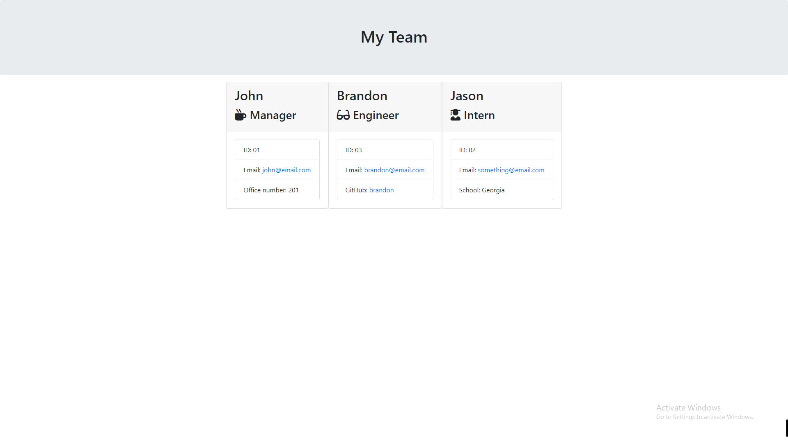

# My-Special-Team

A CLI app designed to make your special project team, with managers, engineers, and interns

## Preview

## How to install and access

* Run npm install
* Run npm start
* Get your html file from the "output" directory/folder

## What I did

Used Inquirer to prompt the user to input their team members and the data of said team members then render it.

## Clean Code Guarantee

It should have no issues with readability

Comments were used to explain what items are doing what as to not cause confusion

## Contributing

If you want to change anything let me know via a dm to my github page.
